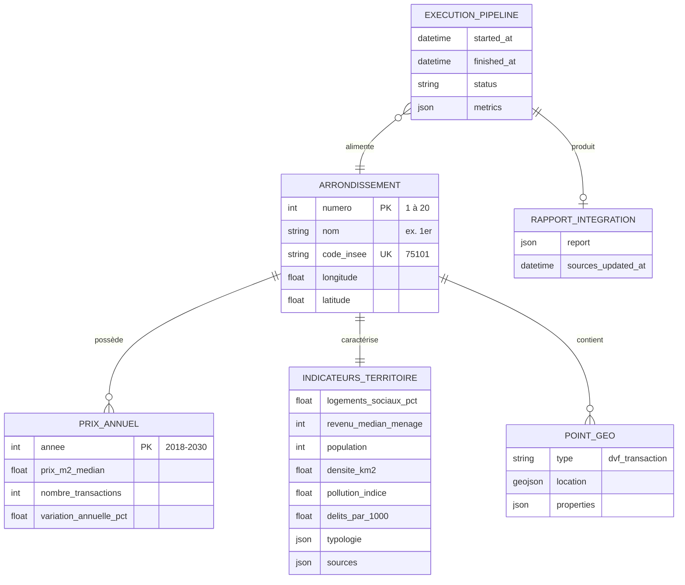

# Modèle de données — Urban Data Explorer

Document de référence : **MCD**, **MLD** et **dictionnaire de données** alignés sur le code actuel (`database/init.sql`, Gold JSON, MongoDB `geo_points`).

---

## Faut-il les inclure dans le rapport ?

| Livrable | Obligatoire ? | Intérêt pour ce projet |
|----------|---------------|------------------------|
| **MCD** | Non formellement | Montre la compréhension métier (arrondissement au centre) |
| **MLD** | Recommandé | Vous avez déjà PostgreSQL + Mongo → à documenter pour la soutenance |
| **Dictionnaire** | Recommandé | Valide C2/C3 (qualité, traçabilité des indicateurs) |

**Verdict :** pas strictement obligatoire si le jury ne le demande pas, mais **fortement conseillé** pour le chapitre 5.2 et la compétence « schéma de données ». Ce document peut être inséré en annexe du rapport ou résumé en 2–3 pages dans `RAPPORT_PROJET.md`.

---

## 1. MCD — Modèle Conceptuel de Données

### 1.1 Périmètre modélisé

Le MCD décrit le **domaine métier** : comparer les territoires parisiens (arrondissements) sur des indicateurs immobiliers et socio-territoriaux. Il couvre :

- la **couche analytique relationnelle** (PostgreSQL) ;
- la **couche géospatiale** (MongoDB) ;
- le **jeu Gold JSON** (modèle document enrichi, non normalisé).

### 1.2 Diagramme entité-association (vue métier)



### 1.3 Entités et associations (lecture métier)

**ARRONDISSEMENT** — entité centrale. Identifiée par son numéro (1–20) et son code INSEE (75101–75120). Chaque arrondissement est un territoire de comparaison.

**PRIX_ANNUEL** — association 1,N entre arrondissement et année. Un arrondissement a plusieurs prix médians annuels (série temporelle DVF).

**INDICATEURS_TERRITOIRE** — association 1,1 : un bloc d'indicateurs socio-économiques et environnementaux par arrondissement (logements sociaux, revenus, pollution, délinquance, typologie).

**POINT_GEO** — association 1,N : points géolocalisés (transactions DVF) rattachés à un arrondissement. Stockés en NoSQL pour flexibilité du schéma et requêtes spatiales.

**EXECUTION_PIPELINE** / **RAPPORT_INTEGRATION** — entités de gouvernance : traçabilité des chargements et des sources open data.

### 1.4 Règles de gestion

- Un arrondissement a exactement **un numéro entre 1 et 20**.
- Un couple (arrondissement, année) ne peut avoir qu'**un seul** prix médian en base relationnelle.
- Les indicateurs territoriaux sont **agrégés** : pas de données nominatives individuelles (conformité RGPD).
- Les points géo proviennent du **Bronze** ; le Gold agrégé est en **SQL/JSON**, pas en Mongo.

---

## 2. MLD — Modèle Logique de Données

### 2.1 PostgreSQL (relationnel — couche Gold)

Schéma physique : `database/init.sql` — base `urban_data`.

```mermaid
erDiagram
    arrondissements ||--o{ prix_annuel : "FK arrondissement"
    arrondissements ||--|| indicateurs_arrondissement : "FK arrondissement PK"

    arrondissements {
        INTEGER arrondissement PK "CHECK 1-20"
        VARCHAR nom "NOT NULL"
        CHAR code_insee UK "NOT NULL"
        DOUBLE_PRECISION longitude
        DOUBLE_PRECISION latitude
        TIMESTAMPTZ updated_at
    }

    prix_annuel {
        SERIAL id PK
        INTEGER arrondissement FK
        INTEGER annee "CHECK 2018-2030"
        DOUBLE_PRECISION prix_m2_median
        INTEGER nombre_transactions
        DOUBLE_PRECISION variation_annuelle_pct
    }

    indicateurs_arrondissement {
        INTEGER arrondissement PK_FK
        DOUBLE_PRECISION logements_sociaux_pct
        INTEGER revenu_median_menage
        INTEGER revenu_moyen_menage
        INTEGER densite_km2
        INTEGER population
        DOUBLE_PRECISION pollution_indice_atmo
        DOUBLE_PRECISION delits_par_1000
        INTEGER total_delits
        JSONB typologie_json
        JSONB sources_json
        TIMESTAMPTZ updated_at
    }

    pipeline_runs {
        SERIAL id PK
        TIMESTAMPTZ started_at
        TIMESTAMPTZ finished_at
        VARCHAR status
        JSONB metrics_json
    }

    integration_report {
        SERIAL id PK
        JSONB report_json
        TIMESTAMPTZ sources_updated_at
        TIMESTAMPTZ created_at
    }

    governance_access {
        VARCHAR role_name PK
        VARCHAR profil
        TEXT description
        BOOLEAN select_allowed
        BOOLEAN write_allowed
    }
```

**Contraintes d'intégrité :**
- `prix_annuel` : `UNIQUE (arrondissement, annee)`, `ON DELETE CASCADE`
- `indicateurs_arrondissement` : PK = FK vers `arrondissements`
- Rôle `ude_reader` : `SELECT` uniquement

**Vues métier (non matérialisées) :**

| Vue | Tables sources | Usage |
|-----|----------------|-------|
| `v_prix_par_annee` | arrondissements ⨝ prix_annuel | BI, exports |
| `v_indicateurs_complets` | arrondissements ⨝ indicateurs | Cartographie |
| `v_accessibilite_prix_revenu` | arr + indicateurs + prix (MAX annee) | KPI accessibilité |
| `v_catalogue_donnees` | — | Gouvernance |

**Formule vue accessibilité :**
```
mois_revenu_pour_50m2 = (prix_m2_median × 50) / (revenu_median_menage / 12)
```

### 2.2 MongoDB (NoSQL — points géolocalisés)

Base : `urban_data` — collection : `geo_points`

```json
{
  "_id": "ObjectId",
  "type": "dvf_transaction | geocoded_address",
  "arrondissement": 6,
  "code_insee": "75106",
  "location": {
    "type": "Point",
    "coordinates": [2.3322, 48.8499]
  },
  "properties": {
    "prix_m2": 12500.0,
    "surface_m2": 45.0,
    "date_mutation": "2024-03-15",
    "source_year": 2024,
    "provider": "dvf_native | ban | nominatim"
  },
  "synced_at": "2026-06-26T10:21:00"
}
```

**Index :**
- `arrondissement` (asc)
- `type` (asc)
- `code_insee` (asc)
- `location` (`2dsphere`)

**Cardinalité :** ~40 points DVF max par arrondissement + adresses géocodées (échantillon Bronze).

### 2.3 Gold JSON (document — source de vérité MVP)

Fichier : `data/gold/real_estate_data_gold_latest.json`

Structure logique (non relationnelle) :

```
GoldDocument
├── timestamp, generated_at, sources_updated_at
├── integration_report (object)
├── summary { nb_arrondissements, periode_min, periode_max }
└── arrondissements[] (20 éléments)
    ├── arrondissement, nom, code_insee
    ├── statistiques { prix_m2_actuel, min, max, moyen, median }
    ├── evolution_annuelle[] { annee, prix_m2_median, nombre_transactions }
    ├── prix_m2_historique[] { date, prix_m2 }
    ├── logements_sociaux_pourcentage
    ├── logements_sociaux_evolution[] { annee, logements_sociaux_pct }
    ├── loyers { loyer_m2_median, methode, ... }
    ├── typologie { repartition_pieces, type_logement, statistiques }
    ├── revenus_moyens { revenu_median_menage, ... }
    ├── densite_population { population, superficie_km2, densite_km2 }
    ├── pollution_qualite_air { indice_atmo, indice_atmo_local, ... }
    ├── delits_enregistres { ... }
    ├── accessibilite_logement { mois_revenu_pour_50m2_achat, ... }
    ├── transports_publics { stations_metro, ... }
    ├── vegetation_arbres { ... }
    ├── geocoding { longitude, latitude, ... }
    ├── _sources { par indicateur }
    └── data_quality { na_policy, missing_fields, imputed_fields }
```

**Relation MCD → MLD :** le Gold JSON est une **dénormalisation** des tables SQL + champs supplémentaires (transports, végétation, accessibilité) non persistés en PostgreSQL.

### 2.4 Exports analytiques (tables plates)

| Fichier | Grain | Clé logique |
|---------|-------|-------------|
| `donnees_fusionnees_latest.csv` | 1 ligne / arrondissement | `arrondissement` |
| `prix_annuel` (Parquet) | 1 ligne / arr × année | `(arrondissement, annee)` |
| GeoJSON export | 1 feature / arrondissement | `code_insee` |

---

## 3. Dictionnaire de données

### 3.1 Référentiel territorial

| Attribut | Table / bloc | Type | Description | Source | Contraintes |
|----------|--------------|------|-------------|--------|-------------|
| `arrondissement` | arrondissements | INTEGER | Numéro 1–20 | Référentiel Paris | PK, NOT NULL |
| `nom` | arrondissements | VARCHAR(64) | Libellé (« 1er », « 13e ») | Référentiel | NOT NULL |
| `code_insee` | arrondissements | CHAR(5) | Code commune INSEE | INSEE | UK, 75101–75120 |
| `longitude` | arrondissements | FLOAT | Centroïde WGS84 | Géocodage | -180 à 180 |
| `latitude` | arrondissements | FLOAT | Centroïde WGS84 | Géocodage | -90 à 90 |

### 3.2 Indicateurs immobiliers

| Attribut | Table / bloc | Type | Unité | Description | Source |
|----------|--------------|------|-------|-------------|--------|
| `prix_m2_median` | prix_annuel | FLOAT | €/m² | Prix médian des transactions | DVF (data.gouv) |
| `nombre_transactions` | prix_annuel | INTEGER | nb | Volume de ventes agrégé | DVF |
| `variation_annuelle_pct` | prix_annuel | FLOAT | % | Variation vs année N-1 | Calculé |
| `prix_m2_actuel` | Gold.statistiques | FLOAT | €/m² | Dernier prix médian connu | Calculé |
| `loyer_m2_median` | Gold.loyers | FLOAT | €/m²/mois | Loyer de référence encadrement | OpenData Paris |
| `typologie_json` | indicateurs | JSONB | % | Répartition Studio–T5+ | DVF |

### 3.3 Indicateurs socio-économiques

| Attribut | Type | Unité | Description | Source |
|----------|------|-------|-------------|--------|
| `logements_sociaux_pct` | FLOAT | % | Part de logements sociaux | CDL / Paris open data |
| `revenu_median_menage` | INTEGER | €/an | Revenu médian du ménage | Filosofi (data.gouv) |
| `revenu_moyen_menage` | INTEGER | €/an | Revenu moyen du ménage | Filosofi |
| `population` | INTEGER | hab. | Population arrondissement | Jeu délinquance / référentiel |
| `densite_km2` | INTEGER | hab./km² | population / superficie | Calculé |
| `delits_par_1000` | FLOAT | faits/1000 hab. | Délinquance enregistrée | SSMSI (data.gouv) |
| `pollution_indice_atmo` | FLOAT | 1–10 | Indice qualité de l'air | OpenData Paris (Citeair) |

### 3.4 Indicateurs calculés (enrichissement)

| Attribut | Bloc Gold | Formule | Unité | Interprétation |
|----------|-----------|---------|-------|----------------|
| `mois_revenu_pour_50m2_achat` | accessibilite_logement | `(prix_m² × 50) / (revenu/12)` | mois | Effort d'achat 50 m² |
| `mois_revenu_pour_50m2_location` | accessibilite_logement | `(loyer_m² × 50 × 12) / (revenu/12)` | mois | Effort locatif 50 m² |
| `part_revenu_loyer_50m2_pct` | accessibilite_logement | `(loyer_m² × 50 × 12) / revenu × 100` | % | Tension locative |
| `indice_atmo_local` | pollution_qualite_air | `indice_Paris × f(densité, transports)` | 1–10 | Proxy inter-arrondissements |
| `score_sante_proximite` | sante_data.js | Σ ratios × pondérations | 0–100 | Accessibilité santé |

### 3.5 Traçabilité et qualité

| Attribut | Table / bloc | Type | Description |
|----------|--------------|------|-------------|
| `sources_json` | indicateurs_arrondissement | JSONB | Métadonnées sources par indicateur |
| `_sources` | Gold (par arr.) | object | provider, dataset, status, fetched_at, url |
| `integration_report` | Gold racine / table SQL | JSONB | Statut global par source (dvf, filosofi, insee…) |
| `data_quality` | Gold / Silver | object | Politique NA, champs manquants, imputés |
| `metrics_json` | pipeline_runs | JSONB | Durées par étape du pipeline |

**Valeurs `status` dans `_sources` :** `live` (API), `cached` (fichier local), `simulated` (donnée de repli), `skipped` (source indisponible).

### 3.6 Points géolocalisés (MongoDB)

| Attribut | Type | Description | Obligatoire |
|----------|------|-------------|-------------|
| `type` | string | `dvf_transaction` ou `geocoded_address` | Oui |
| `arrondissement` | int | 1–20 | Oui |
| `location` | GeoJSON Point | [longitude, latitude] | Oui |
| `properties.prix_m2` | float | Prix au m² de la transaction | Si DVF |
| `properties.surface_m2` | float | Surface du bien | Si DVF |
| `properties.date_mutation` | string | Date de vente ISO | Si DVF |
| `properties.provider` | string | `dvf_native`, `ban`, `nominatim` | Oui |

### 3.7 Politique des valeurs manquantes

| Politique | Code | Application |
|-----------|------|-------------|
| Exclusion | `drop` | Date ou prix obligatoire manquant |
| Null explicite | `null` | Indicateur secondaire absent |
| Rejet numérique | `drop` | Prix hors [1000 ; 50000] €/m² |

Référence code : `data_normalization.py` → `NA_POLICY`.

---

## 4. Correspondance des couches Medallion

| Couche | Format | Modèle dominant | Rôle |
|--------|--------|-----------------|------|
| Bronze | JSON, CSV.gz, cache | Brut / semi-structuré | Ingestion, géocodage |
| Silver | JSON | Document nettoyé | Qualité, validation |
| Gold | JSON + SQL + Parquet | Hybride relationnel + document | Consommation API/BI |
| Mongo | Documents GeoJSON | NoSQL géospatial | Carte points DVF |
| Export | CSV, Parquet, GeoJSON | Tabulaire / géo | ML, Power BI |

---

## 5. Utilisation dans le rapport

**Recommandation :** insérer en **annexe** du rapport (ou section 5.2 allégée + renvoi vers ce fichier) :

- **1 page** — MCD (diagramme + règles de gestion)
- **1 page** — MLD PostgreSQL + mention Mongo
- **2–3 pages** — Dictionnaire (tableaux ci-dessus, éventuellement réduits aux attributs clés)

Cela renforce la compétence **C3** (étapes documentées) et la crédibilité face au jury sur la **conception des données**.

---

*Document aligné sur le code — juin 2026*
