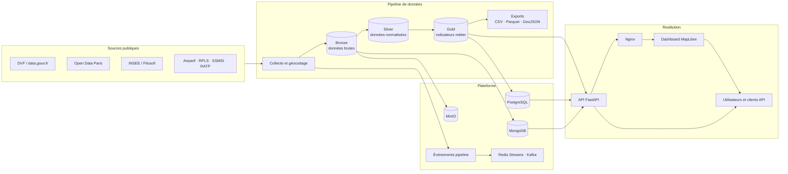

# Urban Data Explorer

[](https://www.python.org/)
[](https://fastapi.tiangolo.com/)
[](https://docs.docker.com/compose/)
[](https://github.com/totosoubi/UrbanDataExplorer1/actions/workflows/pipeline-scheduled.yml)
[](LICENSE)

Plateforme de données urbaines consacrée au marché immobilier parisien. Elle collecte des données publiques, les transforme selon une architecture Medallion et les expose dans une API FastAPI ainsi qu'un dashboard cartographique interactif.

Le projet permet d'explorer les 20 arrondissements et les 992 IRIS parisiens à partir d'indicateurs immobiliers, sociaux, environnementaux et de mobilité : prix au mètre carré, loyers, revenus, logements sociaux, pollution, végétation, délinquance et transports.

## Fonctionnalités

- pipeline batch Bronze → Silver → Gold avec contrôles de qualité ;
- API REST FastAPI et documentation OpenAPI ;
- dashboard MapLibre avec carte choroplèthe, sélecteur arrondissement/IRIS et comparateur d'arrondissements ;
- export CSV, Parquet et GeoJSON ;
- stockage PostgreSQL, MongoDB et MinIO ;
- diffusion d'événements par Redis Streams et Kafka ;
- quotas par IP, clé API optionnelle et rôles SQL ;
- déploiement local, Docker Compose et GitHub Actions.

## Architecture



Le pipeline batch produit le snapshot analytique. Les événements Redis/Kafka rendent son état observable, tandis que l'API choisit le backend disponible (`auto`, JSON, PostgreSQL ou MongoDB).

## Structure du dépôt

```text
UrbanDataExplorer1/
├── api.py                     # API REST et endpoints métier
├── pipeline.py                # Orchestration Bronze → Silver → Gold
├── run.py                     # Génération des données et démarrage API
├── data_fetcher.py            # Collecte générique
├── real_estate_fetcher.py     # Collecte des données immobilières
├── data_processor.py          # Nettoyage et enrichissement
├── public_data_integrations.py # Connecteurs vers les données publiques
├── data/
│   ├── bronze/                # Données sources
│   ├── silver/                # Données nettoyées
│   ├── gold/                  # Agrégats prêts à servir
│   └── export/                # Exports générés
├── dashboard/
│   ├── index.html             # Interface cartographique
│   └── static/                # JavaScript, CSS, images et GeoJSON
├── ude_platform/
│   ├── data_access.py         # Accès unifié JSON / SQL / MongoDB
│   ├── enrichment.py          # Indicateurs métier
│   ├── freshness.py           # Fraîcheur du snapshot
│   ├── api_security.py        # Authentification et quotas
│   ├── sync_databases.py      # Synchronisation des stockages
│   └── streaming.py           # Événements Redis
├── services/                  # Consumers Redis et Kafka
├── database/                  # Schéma et migrations PostgreSQL
├── tests/                     # Tests automatisés
├── scripts/                   # Validation et exploitation
├── docker-compose.yml         # Stack locale complète
└── .github/workflows/         # Pipeline planifié et déploiement
```

## Démarrage rapide

### Prérequis

- Python 3.11 ou version compatible ;
- `pip` ;
- Docker et Docker Compose pour la stack complète.

### Installation locale

```bash
git clone https://github.com/totosoubi/UrbanDataExplorer1.git
cd UrbanDataExplorer1

python3 -m venv .venv
source .venv/bin/activate
pip install -r requirements.txt
cp .env.example .env
```

Générez les jeux Bronze, Silver et Gold, puis démarrez l'API :

```bash
python pipeline.py
python run.py
```

Services disponibles par défaut :

- dashboard : <http://localhost:8001/dashboard/> ;
- API : <http://localhost:8001> ;
- Swagger UI : <http://localhost:8001/docs>.

### Stack Docker

```bash
docker compose up --build -d
docker compose ps
```

L'entrée Nginx est disponible sur <http://localhost:8000>. Les identifiants présents dans `docker-compose.yml` sont exclusivement destinés au développement local.

## API principale

| Méthode | Endpoint | Description |
|---|---|---|
| `GET` | `/arrondissements` | Liste enrichie des arrondissements |
| `GET` | `/iris` | Référentiel et indicateurs calculés pour les 992 IRIS |
| `GET` | `/iris/geojson` | Contours IRIS officiels filtrables par arrondissement |
| `GET` | `/iris/{code_iris}` | Détail des indicateurs natifs d'un IRIS |
| `GET` | `/prix?annee=2024` | Prix immobiliers par année |
| `GET` | `/pollution` | Indicateurs de qualité de l'air |
| `GET` | `/comparaison?arr1=1&arr2=6` | Comparaison de deux arrondissements |
| `GET` | `/timeline?arr=6` | Évolution temporelle d'un arrondissement |
| `GET` | `/platform/freshness` | Fraîcheur du snapshot et latence |
| `GET` | `/platform/governance` | Authentification, quotas et gouvernance |
| `GET` | `/health` | État de l'API et des services |

La spécification complète est générée automatiquement dans `/docs` et `/openapi.json`.

## Modèle de données

| Couche | Rôle | Exemple |
|---|---|---|
| Bronze | Conservation des réponses sources | transactions et points géolocalisés bruts |
| Silver | Normalisation, dédoublonnage et validation | types harmonisés et coordonnées contrôlées |
| Gold | Agrégation et calcul des indicateurs | prix médian, accessibilité et tension locative |

Principaux calculs :

- accessibilité : coût estimé d'un logement de 50 m² rapporté au revenu mensuel ;
- tension locative : loyer annuel estimé rapporté au revenu médian ;
- densité : population rapportée à la superficie ;
- qualité de l'air : indice parisien contextualisé par la densité et les transports.

## Sources de données

| Source | Données utilisées |
|---|---|
| [DVF](https://www.data.gouv.fr/fr/datasets/demandes-de-valeurs-foncieres/) | Transactions immobilières |
| [Open Data Paris](https://opendata.paris.fr/) | Loyers, arbres, transports et qualité de l'air |
| [INSEE](https://www.insee.fr/) | Revenus et statistiques territoriales |
| [IGN-INSEE — Contours...IRIS®](https://www.data.gouv.fr/datasets/contours-iris-r) | Contours des 992 IRIS parisiens, millésime 2024 |
| [INSEE — Recensement IRIS 2021](https://www.insee.fr/fr/statistiques/8268806) | Population et densité par IRIS |
| [INSEE — Filosofi IRIS 2021](https://www.insee.fr/fr/statistiques/8229323) | Niveau de vie et pauvreté par IRIS |
| [INSEE — Logement IRIS 2021](https://www.insee.fr/fr/statistiques/8268838) | Typologie et logements sociaux par IRIS |
| [Paris Data — Les arbres](https://opendata.paris.fr/explore/dataset/les-arbres/) | Végétation géolocalisée par IRIS |
| RPLS | Logements sociaux |
| SSMSI | Délinquance enregistrée |

La géométrie IRIS est officielle. Les prix, volumes, surfaces et pièces sont calculés par jointure spatiale des ventes DVF ; population, revenus, pauvreté, logements et typologie proviennent des bases IRIS INSEE ; les arbres sont affectés spatialement. Un minimum de trois ventes par IRIS et par année est exigé. Les indicateurs sans source assez fine (loyers, délinquance, pollution, transports et santé) restent absents au lieu d'être recopiés depuis l'arrondissement.

Pour actualiser le référentiel embarqué depuis l'export officiel :

```bash
curl -L --get \
  'https://data.iledefrance.fr/api/explore/v2.1/catalog/datasets/iris/exports/geojson' \
  --data-urlencode 'where=dep=75' \
  -o /tmp/iris75.geojson
python scripts/update_iris_geojson.py \
  /tmp/iris75.geojson dashboard/static/data/paris_iris.geojson
python scripts/build_iris_metrics.py
```

## Tests

```bash
python -m pytest -q
```

Les tests couvrent notamment l'API, les enrichissements, la fraîcheur des données, l'accès aux stockages, Kafka et le chargement SQL. Les tests nécessitant une infrastructure externe sont ignorés lorsque celle-ci n'est pas disponible.

## Configuration et sécurité

Copiez `.env.example` vers `.env`, puis renseignez uniquement les services utilisés. Le fichier `.env` est ignoré par Git.

Variables principales :

| Variable | Usage |
|---|---|
| `INSEE_API_KEY` | Accès direct à l'API INSEE |
| `INSEE_CONSUMER_KEY` / `INSEE_CONSUMER_SECRET` | Authentification OAuth INSEE |
| `UDE_API_KEY` | Protection optionnelle des endpoints |
| `DATA_BACKEND` | Sélection de `auto`, `json`, `postgres` ou `mongo` |
| `POSTGRES_URL` / `MONGO_URL` | Connexion aux bases |
| `REDIS_URL` / `KAFKA_BOOTSTRAP_SERVERS` | Streaming et événements |

Ne versionnez jamais de jeton, mot de passe réel ou fichier `.env`. Remplacez les identifiants de développement avant tout déploiement public.

## Documentation

- [Architecture du Data Lake](DATA_LAKE.md)
- [Base de données relationnelle](BDD_RELATIONNELLE.md)
- [Base de données non relationnelle](BDD_NON_RELATIONNELLE.md)
- [Déploiement](DEPLOIEMENT.md)
- [Conformité RGPD](RGPD.md)
- [Validation RNCP](VALIDATION_RNCP.md)
- [Support de présentation](PRESENTATION.md)

## Équipe

Projet réalisé en groupe par :

- [Thomas Soubirou-Pouey — `totosoubi`](https://github.com/totosoubi)
- [Nathan — `nathan7836`](https://github.com/nathan7836)
- [Estelle — `Pandyyyyyyy`](https://github.com/Pandyyyyyyy)
- [Killian — `KillianKS`](https://github.com/KillianKS)

Les auteurs Git des commits restent la source de vérité pour l'attribution précise des modifications.

## Licence

Ce projet est distribué sous licence [MIT](LICENSE).
